# GitterDesign
- Gitterの設計情報はこのファイルで行う
  - ちゃんと静的モデリングするか～
# 構成
  
# コンテキスト図

# DFD0

# モジュール構造図

# データ設計
## M5stack⇔TCP/IPサーバー(Node.js)間
| 項目 |値|行先|備考|
|:--:|:--:|:--:|:--:|
|ギター検出情報|on/off| M5→Express|ギター検出情報とタイムスタンプは一緒に送信|
|タイムスタンプ|yyyy/mm/dd hh/mm/ss| M5→Express||
|バッテリー容量|battery:〇〇| M5→Express||

## Expressサーバー(Node.js)⇔React間
| 項目 |値|行先|例|
|:--:|:--|:--:|:--|
|ギター練習情報|{ "practice_start_time":yyyy/mm/dd hh/mm/ss "practice_end_time":yyyy/mm/dd hh/mm/ss}|Express→React|{ "practice_start_time":2023/07/22 17:56:39  "practice_end_time":2023/07/23 18:09:32}|
|デバイス情報|{ "battery":バッテリー情報 }|Express→React|{ "battery":90 }|

