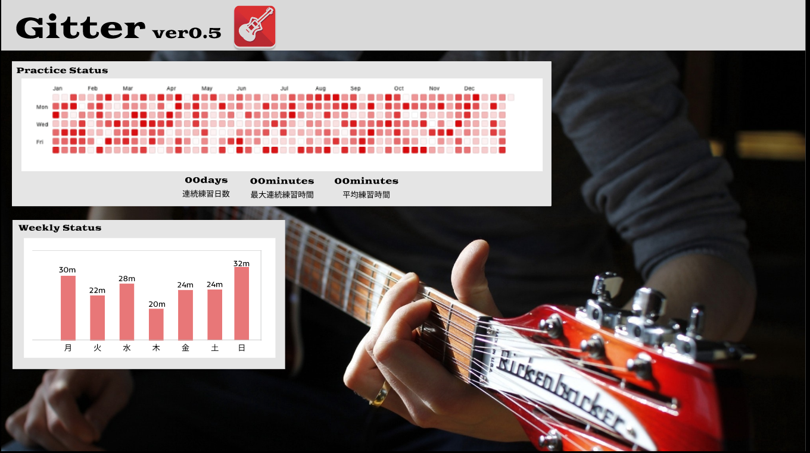
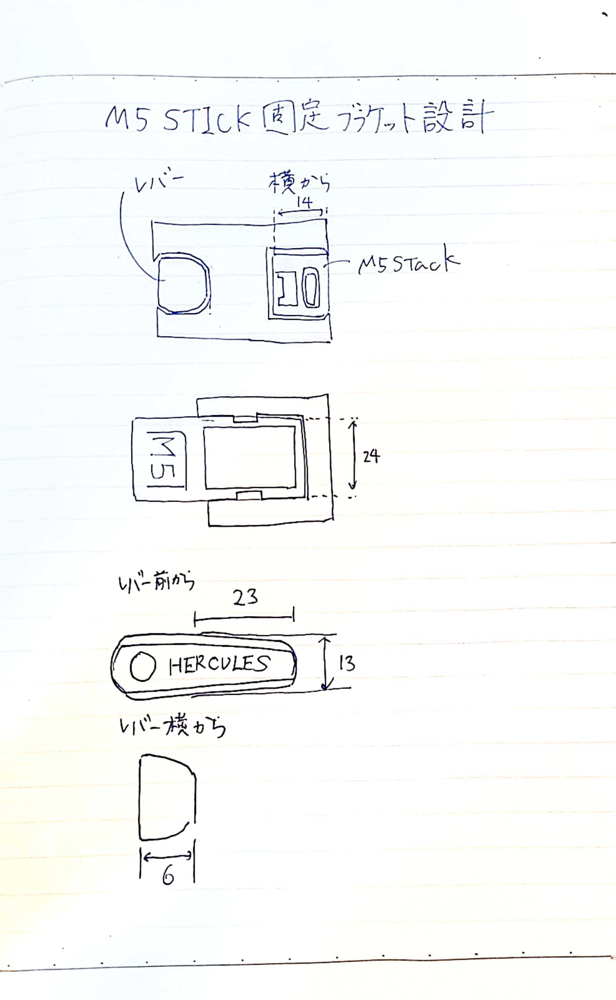

# GitterDesign
- Gitterの設計情報はこのファイルで行う
  - ちゃんと静的モデリングするか～
# 構成
  
# コンテキスト図

# DFD0

# DFD1(ReactでのHMI側)

# モジュール構造図

# データ設計
## M5stack⇔TCP/IPサーバー(Node.js)間
| 項目 |値|行先|備考|
|:--:|:--:|:--:|:--:|
|練習検出情報|START/END|M5→Express|練習開始・終了情報とタイムスタンプは一緒に送信|
|バッテリー容量|battery:〇〇| M5→Express||

## サーバー側ギター検出情報保存ファイル（json)
| 項目 |値|行先|例|
|:--:|:--|:--:|:--|
|練習情報|{ "practice_status":START/END "time_stamp":yyyy/mm/dd hh:mm:ss.mmm }|ローカルに保存|

## Expressサーバー(Node.js)⇔React間
| 項目 |値|行先|
|:--:|:--|:--:|
|練習情報|{ "practice_status":START/END "time_stamp":yyyy/mm/dd hh:mm:ss.mmm }|Express→React|{"ID":aaaaaaa "practice_start_time":2023/07/22 17:56:39  "practice_end_time":2023/07/23 18:09:32}|
|デバイス情報|{ "battery":バッテリー情報 }|Express→React|

## React側練習時間配列
|項目|値|例|
|:--:|:--:|:--:|
|練習情報配列|{date:"日付",count:練習時間分数},|{date:"2023/10/23", count:16.8}, {date:"2023/10/24",count:0}, {date:"2023/10/25",count:20}

# 画面設計
# デザイン図
- https://www.figma.com/file/YPeIc900GOsdSCfJvz9jbA/Gitter-Web%E3%82%A2%E3%83%97%E3%83%AA?node-id=1126%3A9450&t=qhOplVa6hKExsTIF-0

-　一旦こんな感じを目指す
  
  

# ブランケット設計
## ポンチ絵
  
