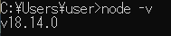
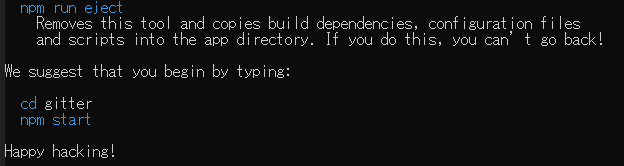
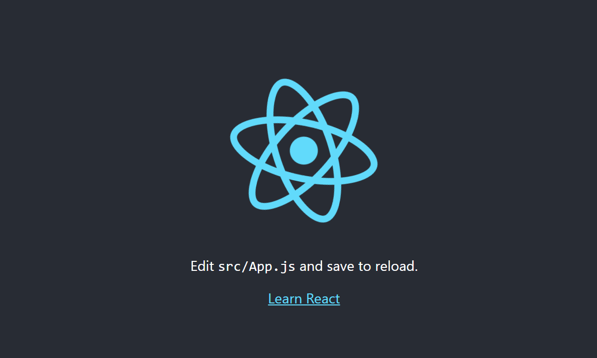
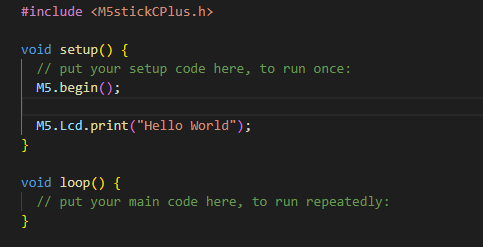
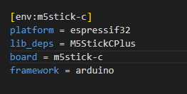

# Gitter
## 課題意識
- ギターの練習が続かない，Githubみたいに毎日草が生えたらやる気起きるのになぁ・・・
## Issue
- 意識せずに勝手に毎日のギターの練習が記録される
## Gitterとは
- Githubのように毎日のギター練習の記録を取ってくれるハードウェア
## 何ができるか
- ギターを練習すると意識しなくてもギターを何月何日にどれくらい練習したかWebにアップしてくれる
- 練習の様子（音や映像）を撮影してWebにアップしてくれる
## イメージ
  

## 構成
- M5 stack C plus
  - 加速度でギターの取り外しを検知
  - Webサーバーに練習情報をPush
- ギタースタンド
  - M5 Stack C plusを固定する（３Dプリンターでアタッチメントを自作）
- クライアント（React）
  - サーバーから受け取った練習情報をもとにGithub風Webページを更新
- サーバー (Node.js)
  - M5 stack C plusから受け取った練習情報をまとめてクライアント側に渡す
## 開発
### React + Javascriptの環境構築
  - https://utubou-tech.com/react-javascript-env/
#### node.jsのインストール
- 公式からインストールしてくる(今回は18.14)
  - https://nodejs.org/ja/download/
- PCを再起動
- コマンドプロンプトで"node- v"と入力
  

### クライアント側開発
#### Reactアプリを作成する
- 任意のフォルダでコマンドプロンプトから下記コマンドを実行してアプリケーションを作成
```
npx create-react-app 任意のアプリケーション名(今回はclient)
```
※アプリケーション名に大文字は使えないので注意

- 下記表示がでれば作成成功
  

#### Reactアプリの動作確認
- アプリ名と同じディレクトリで下記コマンド実行
```
npm start or yarn start
```
- ブラウザでこの画面が表示されれば動作確認完了
 

#### client側でNode.js側から通信を受け取る
- App.jsのコードは以下に編集する
``` javascript
import './App.css';
import { useState,useEffect } from 'react';

function App() {
  //useStateの初期値(空)を設定
  const [message, setMessage] = useState('');

  useEffect(() => {
    //fetchでバックエンドExpressのサーバーを指定
    fetch('/api')
      .then((res) => res.json())
      //生成したjsオブジェクトをdataに代入
      //data.messageで取り出したデータをuseStateに保存
      .then((data) => setMessage(data.message));
  })
  
  
  return (
    <div className="App">
      <h1>Gitter</h1>
      <p>{ message }</p>
    </div>
  );
}

export default App;
```
- useEffect : Reactプリケーションの状態が変更されたときに実行される関数
- useState : Reactアプリケーションの状態を扱うためのもの
- fetch : URLを指定してサーバーと通信するもの
### サーバー側開発
#### Node.jsの初期設定
- 任意のフォルダでコマンドプロンプトで下記コマンドを実行してpackage.jsonを作る
```
npm init --yes
```
#### Expressを使用してバックエンドサーバーを構築する
- 必要なモジュールをインストールする
```
npm install express nodemon
```
Express : フレームワーク
nodemon : ソースを監視して、自動でサーバーを再起動してくれるツール

- myfirst.jsというスクリプトを書く（名前は何でもいい）
```javascript
// ---- ReactのためのExpressサーバー
var express = require('express');

//expressのインスタンスを作成
const app = express();

//ポート番号を指定
const port = 3000;

//'/'パスにget要求があった際に実行する処理
app.get('/',(req, res) => {
    res.send('Hello World!');
});

//3000ポートでlisten
app.listen(port, () => {
    console.log(`listening on *:${port}`);
})
```
- "node myfirst.js"をコマンドプロンプトで実行
- localhost:3000にアクセスして"Hello world"と表示されれば成功

##### APIエンドポイントの作成
- クライアント側(React)からサーバー(node.js)にアクセスする際の，アクセス先（エンドポイント）をサーバー側に準備する
```
//'/api'パスにget要求があった際に実行する処理
app.get('/api',(req, res) => {
    res.send('From Node.js Call');
});
```
##### nodemonでファイル変更時にサーバーを自動再起動するようにする
- package.jsonの記述を以下のように変更する
```
#変更前
"start-node": "node backend/index.js"

#変更後
"start-node": "nodemon backend/index.js"
```
-これで以下コマンドでサーバーを立ち上げられるようになる
```
npm run start-node
```

#### サーバーPC側とM5StickCの通信方式について
- TCP/IP
  - 通信が保証されるのでおすすめ
- WebSocket
  - ブラウザ側でも通信できる
- UDP
  - リアルタイムに通信したいならUDP

- 今回はTCP/IPとする

### バックエンドとフロントエンドを接続
- クライアント(React)からサーバー(Express)にアクセスしてデータを取得
- React側からNode.js側のエンドポイント(localhost:3001/api)にアクセスしてJSONデータを取得してReact側で表示する
- データの保持・取得にはReactのHookであるuseStateとuseEffect,fetchメソッドを使用する．

#### Node側とM5StickCでTCP/IP通信を行う
##### Node側(サーバーモード)
- Node.jsでTCP/IP通信を行うにはnetモジュールが必要．下記コマンドでインストールする
```
npm install net
```
##### Node側のTCP/IPサーバーを立てる
- ポート3000はReact，ポート3001はExpressサーバーが使っているので，ポート3002を使う
- コードは以下

``` javascript
// ---- M5 stickのためのTCPサーバー
const net = require("net")

const server= net.createServer(socket => {
    socket.on('data', data => {
        console.log(data + 'from' + socket.remoteAddress + ':' + socket.remotePort);
        socket.write('server -> Repeating' + data);
    });

    socket.on('close', () =>{
        console.log('client closed connection');
    });
}).listen(3002);

console.log('TCP/IP server listening on port 3002');
```

### M5 Stick側開発
#### 環境構築
- Platform I/OはVS Codeの拡張機能で，Extensionから即インストールできる
- NewProjectから新しいプロジェクトを作成する
  - BoardをM5stick-Cを選択
  - FrameworkはArduino
  - Finishを押下すると新しいPlatformI/Oのプロジェクトが生成される
#### 実装
- src/にmain.cppがある
   
- Helloworldを表示するプログラムを書く
- M5stickCを選択したはずなのに#include<Arduino.h>となっているので，#include<M5stickCPlus.h>に書き換える
```Arduino
#include <M5stickCPlus.h>

void setup() {
  // put your setup code here, to run once:
  M5.begin();

  M5.Lcd.print("Hello World");
}

void loop() {
  // put your main code here, to run repeatedly:
}
```
- M5Stickのライブラリを使用するにはplatform.iniに以下のように記載を追加する必要がある
    
- platform IOのタブに移動するとPROJECT TASKSの中にBuild,Uploadなどのボタンがある．Build→Uploadの順に実行する
- M5stickCplusの液晶にHelloworldと出たらOK
#### TCP/IP通信を行う
- 通信するポートの設定などを行う
```
const int port = 3002; //サーバー側ポート
const IPAddress local_ip(192,168,0,30); //M5Stick IPAddress
const IPAddress server_ip(192,168,0,26); //PC IPAdress
const IPAddress subnet(255,255,255,0);
WiFiClient client;
```
- TCPIPのクライアント側の設定をsetup()の中で行う
```Arduino

//TCP/IP Client設定
WiFi.softAP(ssid,password);
delay(100);
WiFi.softAPConfig(local_ip, local_ip, subnet);
M5.Lcd.print("AP IP address:");
IPAddress myIP = WiFi.softAPIP();
M5.Lcd.println(myIP);

//サーバー接続
M5.Lcd.print("\r\nLocal port: ");
M5.Lcd.println(port);
client.connect(server_ip, port);
```
- loop()の中でデータを送信する
```
char write_data[1];
write_data[0] = 'a';
client.write(write_data, 1);
```
- node.jsのサーバーを立ち上げて，コンソールにデータが届いているか確認する

#### ジャイロセンサーと加速度センサーからM5StickCPlusの回転角傾きを算出する

## 参考情報
- Node.jsとArduinoでプロトタイプ作成
  - https://html5experts.jp/girlie_mac/17684/
- Platform IOでマイコン開発ができる
- Nodeを使ったTCP/IP通信
  - https://hikoleaf.hatenablog.jp/entry/2019/06/09/131620
- React+Node.js(Express)でMySQL連携する
  - https://qiita.com/nemutya/items/b4c606168aa5be610e1e
- Platform I/Oでマイコン開発
  - https://qiita.com/JotaroS/items/1930f156aab953194c9a
- Platform I/OでM5stickC開発
  - https://elchika.com/article/dcc4fd0f-f439-4387-961e-c7d2f903bd4d/
- M5stack 公式API
  - https://docs.m5stack.com/en/api/stickc/imu
- M5Stickで傾き角度算出
  - https://garchiving.com/calculate-angle-of-3axis-rotation-in-6axis-sensor/
- ESP32マイコンとPCでTCP/IP通信する方法
  - https://qiita.com/chibi314/items/828fdedee369ef969af9