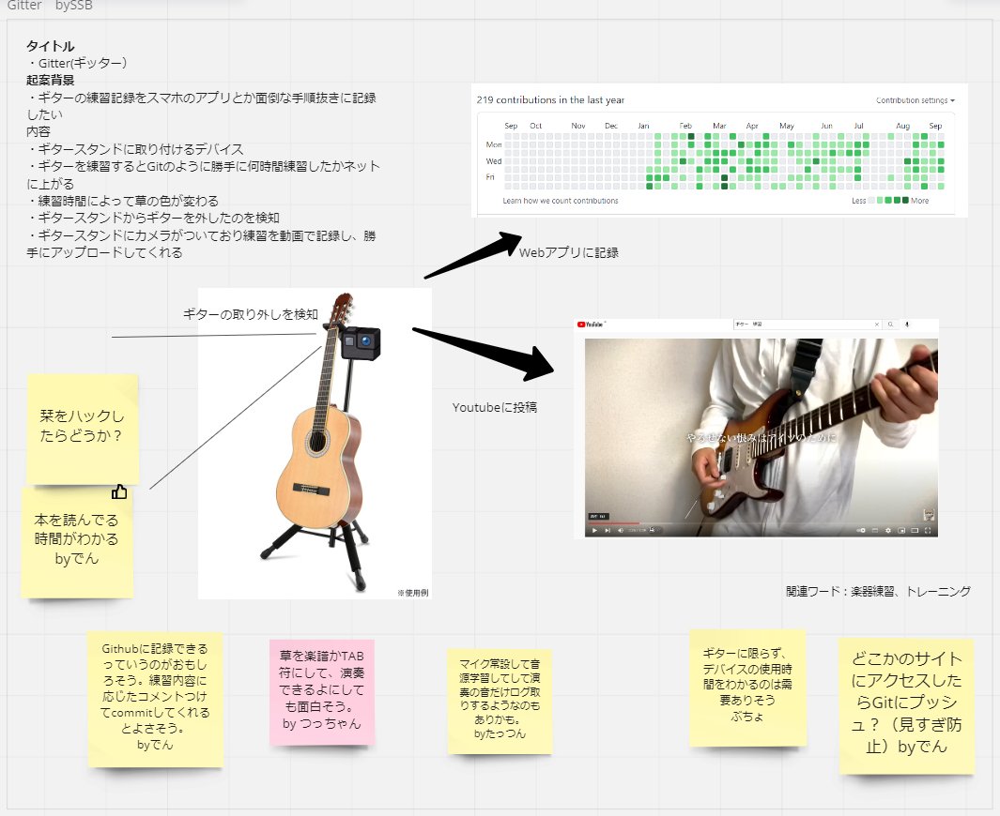

# Gitter
## Gitterとは
- Githubのように毎日のギター練習の記録を取ってくれるハードウェア
## 何ができるか
- ギターを練習すると意識しなくてもギターを何月何日にどれくらい練習したかWebにアップしてくれる
- 練習の様子（音や映像）を撮影してWebにアップしてくれる
## イメージ
  

## 構成
- M5 stack C plus
  - 加速度でギターの取り外しを検知
  - Webサーバーに練習情報をPush
- ギタースタンド
  - M5 Stack C plusを固定する（３Dプリンターでアタッチメントを自作）
- Webサーバー
  - M5 stack C plusから受け取った練習情報をもとにGithub風Webページを更新