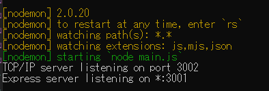
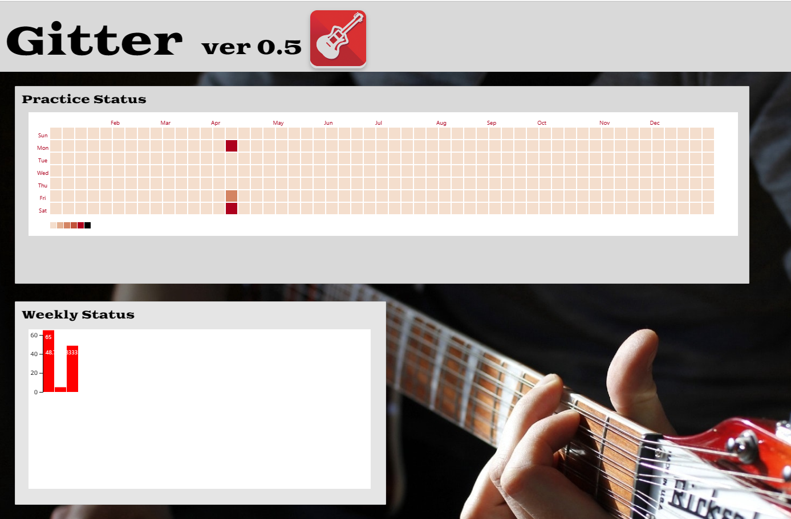

# Gitter使い方(2023-05-09 09:52:26)
1. M5stackの電源を入れる
2. Apps/serverで下記コマンドを実行
```
npm run start-node
```
3. 以下のようにサーバーが立ち上がったことを確認する

4. Apps/client/srcで下記コマンドを実行する
```
npm start
```
5. localhost:3000にGitterが立ち上がる
